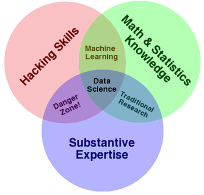

# welcome to data science at GA!

You're seeing this file here because it's the README for the base directory of this
[repo](http://readwrite.com/2013/09/30/understanding-github-a-journey-for-beginners-part-1).
We'll use it to keep track of useful links and information.

## syllabus  
[lec 1]
(https://github.com/jason137/gads_26/tree/master/lec01) - intro & setup  
[lec 2]
(https://github.com/jason137/gads_26/tree/master/lec02) - data exploration & pre-processing with Unix  
[lec 3]
(https://github.com/jason137/gads_26/tree/master/lec03) - data manipulation with pandas  
[lec 4]
(https://github.com/jason137/gads_26/tree/master/lec04) - exploratory data analysis  
[lec 5]
(https://github.com/jason137/gads_26/tree/master/lec05) - data transformations  
[lec 6]
(https://github.com/jason137/gads_26/tree/master/lec06) - concepts of machine learning  
[lec 7]
(https://github.com/jason137/gads_26/tree/master/lec07) - logistic regression & regularization  
[lec 8]
(https://github.com/jason137/gads_26/tree/master/lec08) - naive bayes classification  
[lec 9]
(https://github.com/jason137/gads_26/tree/master/lec09) - decision tree classification  
[lec 10]
(https://github.com/jason137/gads_26/tree/master/lec10) - ensemble classifiers  
[lec 11]
(https://github.com/jason137/gads_26/tree/master/lec11) - project examples  
[lec 12]
(https://github.com/jason137/gads_26/tree/master/lec12) - k-means clustering

## homework schedule 

assignment | topics | due  
--- | --- | ---  
hw 2 | Classification & Cross Validation | 11/11 
project 1 | Elevator Pitch | 11/18 
project 2 | First Draft of Final Project - Data cleanup + EDA | 11/25 
project 3 | Final Project | 12/16 

## datasets  
There are a handful of (small) datasets in this repo that you can use to
practice the techniques we discuss in class. Don't hesitate to seek out & use
other datasets that you find interesting! We can even post them here to share.

## anaconda installation  
https://github.com/jason137/gads_26/blob/master/anaconda.md

## general data science references  
https://github.com/jason137/gads_26/blob/master/general_references.md

## todo
- ROC (1/2)
- sql?
- recsys (1/2)?
- map-reduce (1/2)?
- pca?
