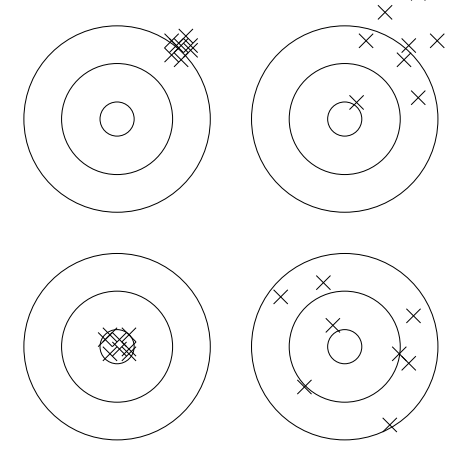

## questions

1) Define the following statistical terms:
- distribution
- quartile
- mean (or average)
- median
- mode
- standard deviation
- variance
- skew
- fat tails
- outlier 
- histogram
- scatterplot

2) Describe these distributions (bonus: using 1 word each!)
- normal distribution
- exponential distribution
- uniform distribution 

3) Take a look at one of the datasets in this repo.
- How is it delimited?
- What does it describe?
- What are some ways you could summarize this data?
- What are some empirical questions you could ask from this data?
- What are some questions you could ask from this data if given other data?

4) What's the difference between an array and an associative array (bonus: use
O)? How are these implemented in python? What are some other fundamental python data 
structures?

5) Define the following Python (more generally, computation) terms:
- iterable
- immutable
- context manager
- lambda
- apply
- package
- namespace
- lazy evaluation 
- computational complexity

6) How would you characterize the accuracy for each of targets below?  

