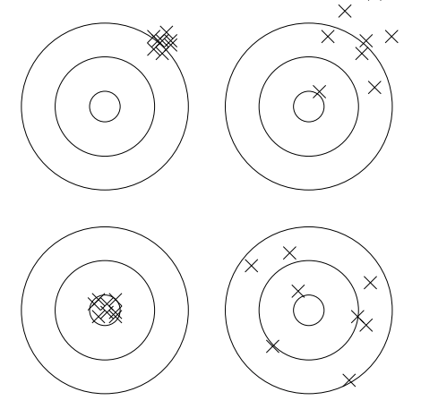

## questions

*1) define these statistical terms*  
- distribution
- quartile
- mean (or average)
- median
- mode
- standard deviation
- variance
- skew
- fat tails
- outlier 
- histogram
- scatterplot

*2) describe these distributions (bonus: using 1 word each!)*  
- normal distribution
- exponential distribution
- uniform distribution 

*3) take a look at one of the datasets in this repo*
- how is it delimited?
- what does it describe?
- what are some ways you could summarize this data?
- what are some empirical questions you could ask from this data?
- what are some questions you could ask from this data if given other data?

*4) what's the difference between an array and an associative array (bonus: use
O)? how are these implemented in python? what are some other fundamental python data 
structures?*

*5) define these python (more generally, computation) terms*  
- iterable
- immutable
- context manager
- lambda
- apply
- package
- namespace
- lazy evaluation 
- computational complexity

*6) how would you characterize the accuracy for each of targets below?*  
  
