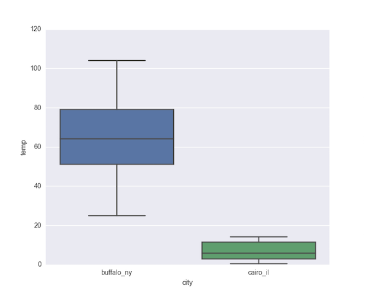
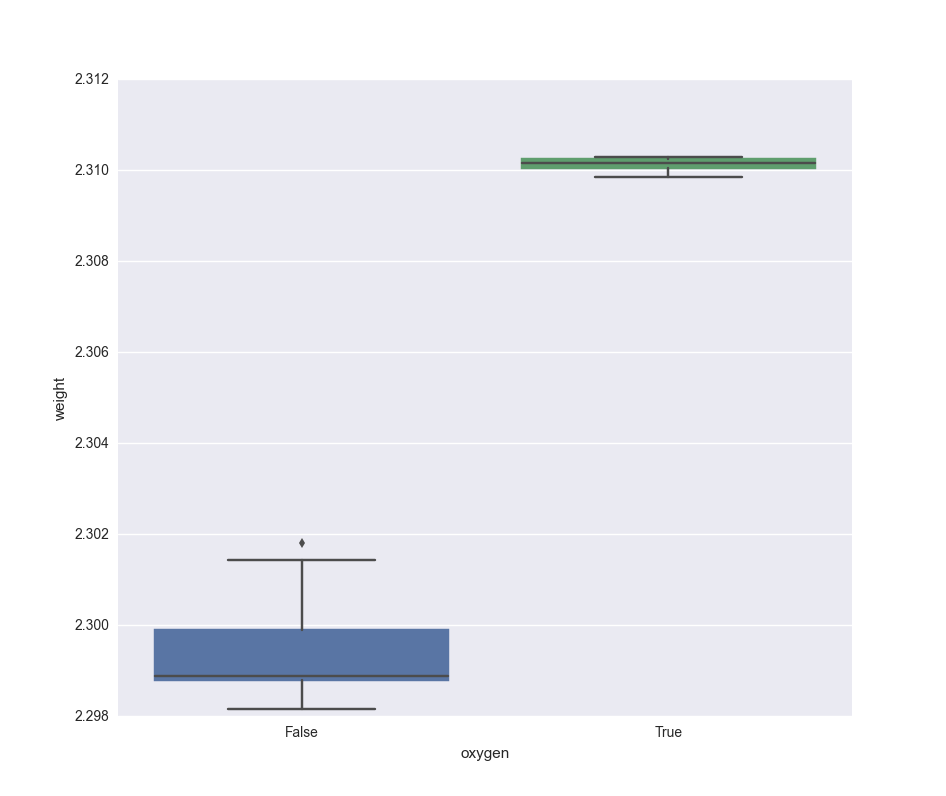
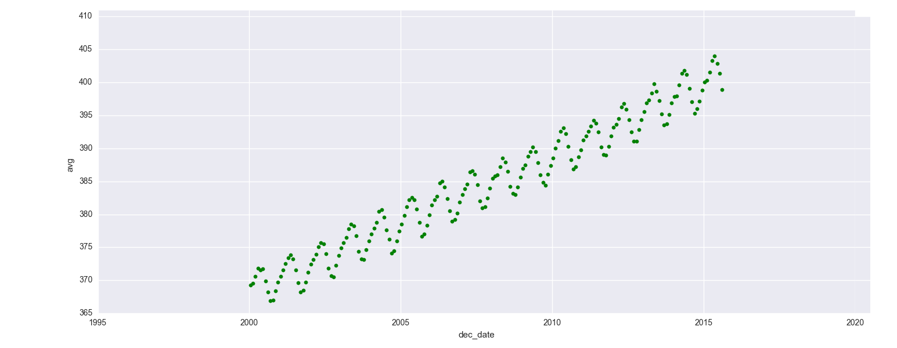

<!-- author: Jason Dolatshahi -->

# exploratory data analysis

Exploratory data analysis (EDA) refers to the set of techniques we apply to get
a "general feel" for what our data is like. We've already done a bit of this
using Unix and pandas, and now we'll see how we can deepen our intuition by
using simple but powerful **graphical techniques**. We'll be guided in our
efforts by the widely respected
[book](http://www.amazon.com/Exploratory-Data-Analysis-John-Tukey/dp/0201076160)
by 
[John Tukey](https://en.wikipedia.org/wiki/John_Tukey), the Feynman-esque champion
problem solver, inventor of the words "bit" and "software", and co-discoverer
of one of the most important numerical
[algorithms](https://en.wikipedia.org/wiki/Fast_Fourier_transform)
around.

Typical early education in statistics tends to cover techniques that can be
classified as confirmatory data analysis (CDA), in particular hypothesis testing.
But without EDA, these confirmatory techniques have nothing to confirm. This is
especially true when data is acquired through **observational sampling**, as
opposed to data generated by a rigorously designed experiment.

Your job during EDA is to think like a detective. You're trying to establish
facts, uncover relationships, and look for clues. Alternatively, during CDA
your job is to think like a prosecutor. You submit evidence to a formal
proceeding in order to draw conclusions. Clearly EDA is not the whole story,
but equally clearly it must be the first step in your data investigation.

Our main tools for EDA will be summaries that capture and distill
important information about our data. By their nature summaries trade details
for clarity, which makes them useful for developing intuition, but the details
remain important as we will see.

## 1. numerical summaries

The most basic numerical summaries of data are statistics like the mean and
standard deviation. But as we've already discussed, these statistics are highly
susceptible to outliers, and they come with serious theoretical
[baggage](http://bit.ly/1KU5LXc)
that is not always justified.

An alternative approach to creating numerical summaries of data relies not on
moments of presumed distributions, but instead on empirical **ranks** of values
in a sample. The *k*th **percentile** *p_k* of a sample can be defined as the
value such that *k* percent of other values in the sample are less than *p_k*.

A basic example is the 50th percentile, or **median**, of a sample. The median
is the value that splits the dataset in half: 50 percent of values are less
than the median, and the other 50 percent are greater than the
median (note that the median is given by the average of the two central values
if the number of values is even).

The 25th and 75th percentiles, respectively called the first and third
**quartiles**, are defined similarly. The difference between the first and third
quartiles is the **interquartile range** (IQR). The IQR contains 50 percent of
the values in the dataset by definition. Note that the median is sometimes
referred to as the second quartile, as in the following diagram:

 

<a href="http://www.hackmath.net/en/calculator/quartile-q1-q3">

### five-number summary

These percentiles can be used to form a useful numerical summary of a dataset called a
**five-number summary** (5NS). We've already seen how to construct these easily
in pandas using the `describe` method on a `DataFrame` object.

Recall that the 5NS is constructed from the median, the quartiles, and the
extreme values (min and max) of the dataset. Note that the min and max can be regarded
as the 0th and 100th percentiles, respectively.

The 5NS gives a quick & useful picture of the shape of a distribution. It gives
you an early look at central tendency, central variation, skewness, and tail
behavior. Look for example at the following 5NS for the distribution of park areas in
Brooklyn:

    In [6]: k[k.Borough == 'Brooklyn'].describe()
    Out[6]:
           Total Acres
    count   308.000000
    mean     14.459286
    std      72.259890
    min       0.500000
    25%       0.996000
    50%       1.528500
    75%       3.194250
    max     798.000000

We can glean a lot of information from this simple output. Half of Brooklyn
parks are smaller than ~1.5 acres, while half are greater. Half are between 1
and ~3.25 acres, while half fall outside this range. This gives us an idea of
central tendency and central variation.

The smallest park is half an acre, and the largest is nearly 800 acres. The
**range** is the difference between these values, and the **range ratio**, or
the max divided by the min, shows that the values range over four orders of
magnitude (from *5 x 10^-1* to *~8 x 10^+2*).

The fact that the values range over three orders of magnitude while the
difference between the min and the third quartile is only one order of magnitude
illustrates that the distribution is highly skewed and likely to display heavy
tails.

### outliers

Generally speaking, **outliers** are values that differ substantially
from most other values in magnitude. Deciding which values should be considered
outliers, and what approach to take in dealing with outliers, is a problem that
usually relies on domain expertise for context and can only be solved on a
case-by-case basis.

But we can use the IQR to form a working definition for outliers: values
that lie farther than +/- 3 times the IQR from the median satisfy this provisional
criterion.

## 2. graphical summaries

Numerical summaries give us a powerful tool for understanding the properties of
our data to a first approximation. Their function is mostly to confirm
expectations, such as centrality in a particular range or the presence of
skew.

We can profoundly deepen our insight by applying some simple plotting
techniques to make **graphical summaries** of our data. These powerful
methods map the reasoning tasks we use to think about data from the number
crunching faculties of our brain to the visual cortex where images and patterns
are recognized. The huge perceptual benefits this gives us are difficult to
overstate.

Graphical summaries can be extremely useful when used correctly, and their quality
tends to increase with their simplicity. Their goal is to simplify analysis and
to describe the properties of our data more deeply.

These summaries are effective because their visual representation
makes them easy to grasp and reason about quickly, and in addition allows us
to include more information without sacrificing clarity. For these reasons,
graphical summaries are especially effective for revealing unexpected
properties of our data.

    goal of viz
    - force message on us
    - uncover unexpected

### histogram

A **histogram** shows us a picture of the distribution of our data, and
illustrates central behavior as well as skew and tail behavior very clearly.
Histograms are generated by collecting values into ranges called **bins** and
producing a graphical representation of the frequency in each bin. Naturally
the number of bins used to create a histogram has an important effect on its
appearance; fewer bins more bins presents finer-grained detail.

Here's a histogram that shows the distribution of values in the `state_hts.tsv`
file (elevation of the highest peak in each state):

    $ cat ../datasets/state_hts.tsv | cut -f3 | histo
    elev_ft, transf = (none)
    num_blanks = 0
              (345.0, 2342.5)    **************
             (2342.5, 4340.0)    **********
             (4340.0, 6337.5)    *********
             (6337.5, 8335.0)    ***
            (8335.0, 10332.0)    *
           (10332.0, 12330.0)    *
           (12330.0, 14328.0)    ********
           (14328.0, 16325.0)    ***
           (16325.0, 18322.0)    
           (18322.0, 20320.0)    *

We can see the expected skew and tail behavior here, as well as some tendency
toward clustering that's not visible in the 5NS.

Here's another example that shows the distribution of masses of dinosaurs that
appear in `dinosaurs.tsv`:

    $ cat ../datasets/dinosaurs.tsv | cut -f3 | histo
    mass_kg, transf = (none)
    num_blanks = 0
                (13.0, 581.7)    ****************
              (581.7, 1150.4)    ***
             (1150.4, 1719.1)    *
             (1719.1, 2287.8)    *
             (2287.8, 2856.5)    **
             (2856.5, 3425.2)    
             (3425.2, 3993.9)    
             (3993.9, 4562.6)    
             (4562.6, 5131.3)    
             (5131.3, 5700.0)    *

In this case we see even more skewed behavior. Looking at the other feature in
this file (length) shows less skew:

    $ cat ../datasets/dinosaurs.tsv | cut -f3 | histo
    length_m, transf = (none)
    num_blanks = 0
                (2.07, 2.923)    *****
               (2.923, 3.776)    ****
               (3.776, 4.629)    *
               (4.629, 5.482)    **
               (5.482, 6.335)    ******
               (6.335, 7.188)    
               (7.188, 8.041)    ***
               (8.041, 8.894)    *
               (8.894, 9.747)    *
                (9.747, 10.6)    *

This gives us a good idea of the shapes of these features in isolation, as well
as a subtle clue toward their relationship. We'll see later how another graphical
technique makes this relationship clear.

Finally here's another example that shows the average monthly CO2 concentration
at the Mauna Loa observatory in Hawaii from Jan 2000 to Aug 2015:

    $ cat ../datasets/mauna_loa.tsv | cut -f4 | histo
    avg, transf = (none)
    num_blanks = 0
             (366.91, 370.61)    ***************
             (370.61, 374.32)    **********************
             (374.32, 378.02)    *******************
             (378.02, 381.72)    ********************
             (381.72, 385.43)    ***********************
             (385.43, 389.13)    *************************
             (389.13, 392.83)    ********************
             (392.83, 396.53)    ******************
             (396.53, 400.24)    *****************
             (400.24, 403.94)    *********

This distribution exhibits a high degree of centrality and symmetry, but
again we'll see later that this dataset has more information that is not
revealed here.

### boxplot

Another useful graphical technique is the **boxplot**, or box and whiskers
diagram. The boxplot is simpler than the histogram in the sense that it's
simply a graphical representation of the 5NS. The values of the 5NS appear as
horizontal lines in the boxplot, and the vertical lines (or "whiskers")
illustrate behavior outside the IQR. A boxplot doesn't contain as much detail
as a histogram, but its simplicity makes it useful for comparing batches of
data to each other.

Here's a boxplot of the data in `snowfall_2.tsv`, separated by city:

The histogram wouldn't capture this distinction, even if we displayed two
histograms for different values of city. By placing these boxplots on the same
axes, we see the contrast instantly.

Here's another example, this time using the data in `rayleigh.tsv`:

Again, the distinction that is impossible to miss with the boxplot would be
difficult to discern using only histograms.

### scatterplot

A **scatterplot** is simply a representation of two features in a 2d
plane. These are useful for illustrating relationships between features.

Here's a scatterplot that shows the relationship between features in
`dinosaurs.tsv`:

Recall the histograms of these features...this relationship
has a subtle signature there (can you see what it is?), but it's not
illustrated clearly until we plot it in 2d.

Here's another scatterplot that shows the data from `mauna_loa.tsv` again:

Again, the linear trend illustrated here (plus the strong evidence of seasonality)
would be difficult to detect using other means.

Because of their usefulness in uncovering relationships, scatterplots can be
especially useful for **feature selection** and **feature engineering**.

You may find this table helpful in recalling the various graphical techniques
we've discussed and their uses:

| type | dims | use |
| ---- | --- | ---- |
| histogram | 1d | shape |
| boxplot | 1d (x number of batches) | comparing shapes |
| scatterplot | 2d | detecting relationships |
