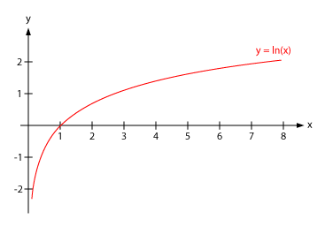
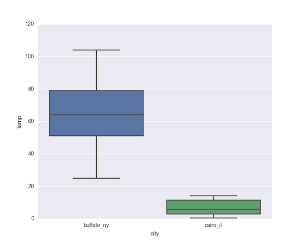
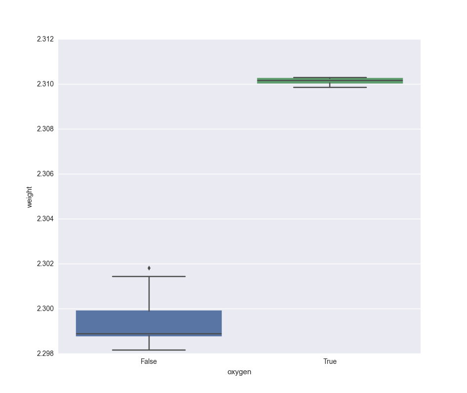

<!-- author: Jason Dolatshahi -->

# data transformations

The exponential distribution is a skewed distribution. Its theoretical minimum
is 0, but the probability of every positive value is greater than zero.

    $ histo -xe
    demo: distr = exp, transf = (none)
    num_blanks = 0
             (0.0208, 0.7558)    **************************************************************************************************************************
             (0.7558, 1.4908)    **************************************************
             (1.4908, 2.2257)    **************
             (2.2257, 2.9607)    ********
             (2.9607, 3.6957)    *****
             (3.6957, 4.4307)    
             (4.4307, 5.1656)    
             (5.1656, 5.9006)    
             (5.9006, 6.6356)    
             (6.6356, 7.3706)    *

This characteristic is common in real-world data that has 0 as a lower bound.
Any sort of count (website visits, housing prices, voter turnout) will display
similarly skewed behavior.

Skewness (or equivalently, the absence of symmetry) can make data difficult to
analyze and compare with other data. **Data transformations** can enforce
greater simplicity on our data, thereby allowing us to gain easier and deeper
insight. You can think of applying a data transformation like choosing a
different representation for your data, or like bringing your data microscope
into focus. The transformation gives you a different point of view, and under
certain important conditions, does not affect your conclusions.

## 1. properties of transformations

Not all transformations are useful to us. We want to use a transformation that
doesn't distort our conclusions, but which does give us a new perspective on
our data.

An example of a transformation that is not useful is the conversion
of feet to meters. Changing units certainly doesn't distort our empirical
conclusions, but it doesn't give us a new perspective either. If the
distribution of heights of all your friends is skewed in feet, it will be
still be skewed in meters. This absence of effect is characteristic of
**linear** transformations, which are composed of translations and constant
scaling (this is embodied in the classical regression equation `y = mx + b`,
where `b` represents a translation and `m` a constant scale factor).

Useful transformations will be **nonlinear**, since it is this nonlinearity
that gives us the desired change in shape. In order to avoid making qualitative
changes to the data, it's necessary to use transformations that are
**monotonic**. This property means that the transformation **preserves ranks**;
for a monotonic function *f* and two values *x* and *y*, the ordering *x < y*
holds if and only if *f(x) < f(y)*.

In intuitive terms, you can think of a monotonic function as one that's
non-decreasing, for example, the log function:

## 2. `log` & `sqrt`

Exploratory data analysis (EDA) refers to the set of techniques we apply to get
a "general feel" for what our data is like. We've already done a bit of this
using Unix and pandas, and now we'll see how we can deepen our intuition by
using simple but powerful **graphical techniques**. We'll be guided in our
efforts by the widely respected
[book](http://www.amazon.com/Exploratory-Data-Analysis-John-Tukey/dp/0201076160)
by 
[John Tukey](https://en.wikipedia.org/wiki/John_Tukey), the Feynman-esque champion
problem solver, inventor of the words "bit" and "software", and co-discoverer
of one of the most important numerical
[algorithms](https://en.wikipedia.org/wiki/Fast_Fourier_transform)
around.

Typical early education in statistics tends to cover techniques that can be
classified as confirmatory data analysis (CDA), in particular hypothesis testing.
But without EDA, these confirmatory techniques have nothing to confirm. This is
especially true when data is acquired through **observational sampling**, as
opposed to data generated by a rigorously designed experiment.

Your job during EDA is to think like a detective. You're trying to establish
facts, uncover relationships, and look for clues. Alternatively, during CDA
your job is to think like a prosecutor. You submit evidence to a formal
proceeding in order to draw conclusions. Clearly EDA is not the whole story,
but equally clearly it must be the first step in your data investigation.

Our main tools for EDA will be summaries that capture and distill
important information about our data. By their nature summaries trade details
for clarity, which makes them useful for developing intuition. But the details
remain important, as we will see.

## 1. numerical summaries

The most basic numerical summaries of data are statistics like the mean and
standard deviation. As we've already discussed, these statistics are highly
susceptible to outliers, and they come with serious theoretical
[baggage](http://bit.ly/1KU5LXc)
that is not always justified.

An alternative approach to creating numerical summaries of data relies not on
moments of presumed distributions, but instead on empirical **ranks** of values
in a sample. The *k*th **percentile** *p_k* of a sample can be defined as the
value such that *k* percent of other values in the sample are less than *p_k*.

A basic example is the 50th percentile, or **median**, of a sample. The median
is the value that splits the dataset in half: 50 percent of values are less
than the median, and the other 50 percent are greater than the
median (note that the median is given by the average of the two central values
if the number of values is even).

The 25th and 75th percentiles, respectively called the first and third
**quartiles**, are defined similarly. The difference between the first and third
quartiles is the **interquartile range** (IQR). The IQR contains 50 percent of
the values in the dataset by definition. Note that the median is sometimes
referred to as the second quartile, as in the following diagram:

 

<a href="http://www.hackmath.net/en/calculator/quartile-q1-q3">

### five-number summary

These percentiles can be used to form a useful numerical summary of a dataset called a
**five-number summary** (5NS). We've already seen how to construct these easily
in pandas using the `describe` method on a `DataFrame` object.

Recall that the 5NS is constructed from the median, the quartiles, and the
extreme values (min and max) of the dataset. Note that the min and max can be regarded
as the 0th and 100th percentiles, respectively.

The 5NS gives a quick & useful picture of the shape of a distribution. It gives
you an early look at central tendency, central variation, skewness, and tail
behavior. Look for example at the following 5NS for the distribution of park areas in
Brooklyn:

    In [6]: k[k.Borough == 'Brooklyn'].describe()
    Out[6]:
           Total Acres
    count   308.000000
    mean     14.459286
    std      72.259890
    min       0.500000
    25%       0.996000
    50%       1.528500
    75%       3.194250
    max     798.000000

We can glean a lot of information from this simple output. Half of Brooklyn
parks are smaller than ~1.5 acres, while half are greater. Half are between 1
and ~3.25 acres, while half fall outside this range. This gives us an idea of
central tendency and central variation.

The smallest park is half an acre, and the largest is nearly 800 acres. The
**range** is the difference between these values, and the **range ratio**, or
the max divided by the min, shows that the values range over four orders of
magnitude (from *5 x 10^-1* to *~8 x 10^+2*).

The fact that the values range over four orders of magnitude while the
difference between the min and the third quartile is only one order of magnitude
illustrates that the distribution is highly skewed and likely to display heavy
tails.

### outliers

Generally speaking, **outliers** are values that differ substantially
from most other values in magnitude. Deciding which values should be considered
outliers, and what approach to take in dealing with outliers, is a problem that
usually relies on domain expertise for context and can only be solved on a
case-by-case basis.

Nonetheless we can use the IQR to create a working definition for outliers: values
that lie farther than 3 times the IQR from the median satisfy this provisional
criterion.

## 2. graphical summaries

Numerical summaries give us a powerful tool for understanding the properties of
our data to a first approximation. Their function is mostly to confirm
expectations, such as centrality in a particular range or the presence of
skew.

We can profoundly deepen our insight by applying some simple plotting
techniques to make **graphical summaries** of our data. These powerful
methods map the reasoning tasks we use to think about data from the number
crunching faculties of our brain to the visual cortex where images and patterns
are recognized. The huge perceptual benefits this gives us are difficult to
overstate.

The quality of a graphical summaries tends to increase with its simplicity. A
good graphical summary should force its message on the viewer, and should
present no obstacles to rapid comprehension. The goal of a graphical summary is
to simplify analysis by describing the properties of our data more deeply.

In addition to the benefits of visual representation, graphical summaries
permit us to include more information without sacrificing clarity. As a result
these techniques are especially effective for revealing unexpected properties
of our data.

### histogram

A **histogram** shows us a picture of the distribution of our data, and
illustrates central behavior as well as skew and tail behavior very clearly.
Histograms are generated by collecting values into ranges called **bins** and
producing a graphical representation of the frequency in each bin. Naturally
the number of bins used to create a histogram has an important effect on its
appearance; the more bins we have, the more detail goes into our picture. Note
that if the number of bins is the same as the number of records, our picture is
the distribution itself.

Here's a histogram that shows the distribution of values in the `state_hts.tsv`
file (elevation of the highest peak in each state):

    $ cat ../datasets/state_hts.tsv | cut -f3 | histo
    elev_ft, transf = (none)
    num_blanks = 0
              (345.0, 2342.5)    **************
             (2342.5, 4340.0)    **********
             (4340.0, 6337.5)    *********
             (6337.5, 8335.0)    ***
            (8335.0, 10332.0)    *
           (10332.0, 12330.0)    *
           (12330.0, 14328.0)    ********
           (14328.0, 16325.0)    ***
           (16325.0, 18322.0)    
           (18322.0, 20320.0)    *

We can see the expected skew and tail behavior here, as well as some tendency
toward clustering that's not visible in the 5NS.

Here's an example that shows the average monthly CO2 concentration
at the Mauna Loa observatory in Hawaii from Jan 2000 to Aug 2015
(from `mauna_loa.tsv`):

    $ cat ../datasets/mauna_loa.tsv | cut -f4 | histo
    avg, transf = (none)
    num_blanks = 0
             (366.91, 370.61)    ***************
             (370.61, 374.32)    **********************
             (374.32, 378.02)    *******************
             (378.02, 381.72)    ********************
             (381.72, 385.43)    ***********************
             (385.43, 389.13)    *************************
             (389.13, 392.83)    ********************
             (392.83, 396.53)    ******************
             (396.53, 400.24)    *****************
             (400.24, 403.94)    *********

This distribution exhibits a high degree of centrality and symmetry, but
we'll see later that this dataset has more information that is not
revealed here.

Histograms are invaluable tools for looking at a distribution, but they don't
get us very far beyond that.

### boxplot

Another useful graphical technique is the **boxplot**, or box and whiskers
diagram. The boxplot is simpler than the histogram in the sense that it's
just a graphical representation of the 5NS. The values of the 5NS appear as
horizontal lines in the boxplot, and the vertical lines (or "whiskers")
illustrate behavior outside the IQR. A boxplot doesn't contain as much detail
as a histogram, but its simplicity makes it useful for comparing batches of
data to each other.

For example, these two histograms show snowfall by city from `snowfall.tsv`:

    $ cut -f2 snowfall.tsv | histo
    Buffalo, NY, transf = (none)
    num_blanks = 0
                (25.0, 32.89)    *
               (32.89, 40.78)    *
               (40.78, 48.67)    *
               (48.67, 56.56)    *****
               (56.56, 64.45)    **
               (64.45, 72.34)    ***
               (72.34, 80.23)    ***
               (80.23, 88.12)    ***
               (88.12, 96.01)
               (96.01, 103.9)    *

    $ cut -f3 snowfall.tsv | histo
    Cairo, IL, transf = (none)
    num_blanks = 0
                  (0.4, 1.77)    ***
                 (1.77, 3.14)    ****
                 (3.14, 4.51)    **
                 (4.51, 5.88)    *
                 (5.88, 7.25)    ***
                 (7.25, 8.62)    *
                 (8.62, 9.99)
                (9.99, 11.36)    *
               (11.36, 12.73)    ***
                (12.73, 14.1)    **

There's a big difference between these distributions, but it's not immediately
obvious. Let's take a look at the difference using a boxplot instead:

Now we see the contrast instantly.

Here's another pair of histograms, this time using the data in `rayleigh.tsv`
(from Lord Rayleigh's experiments which led to the discovery of argon). The
effect is a function of a feature called `purifying_agent`, and depends on
whether the agent is oxygen or something else:

    $ cat rayleigh.tsv | grep Air | cut -f4 | histo

    num_blanks = 0
             (2.3099, 2.3099)
               (2.3099, 2.31)
                 (2.31, 2.31)
               (2.31, 2.3101)    *
             (2.3101, 2.3101)
             (2.3101, 2.3102)    *
             (2.3102, 2.3102)
             (2.3102, 2.3103)    ***
             (2.3103, 2.3103)    *

    $ cat rayleigh.tsv | grep -v Air | cut -f4 | histo
    weight, transf = (none)
    num_blanks = 0
             (2.2982, 2.2985)    *
             (2.2985, 2.2989)    **
             (2.2989, 2.2993)    *
             (2.2993, 2.2996)    *
                (2.2996, 2.3)
                (2.3, 2.3004)
             (2.3004, 2.3007)
             (2.3007, 2.3011)
             (2.3011, 2.3015)    *
             (2.3015, 2.3018)

Again, the distinction is nearly invisible with this representation. The
boxplot makes it impossible to overlook:

### scatterplot

A **scatterplot** is simply a representation of two features in a 2d
plane. These are useful for illustrating relationships between features.
As a result they're especially useful for **feature selection** and
**feature engineering**.

Recall the symmetric histogram from `mauna_loa.tsv`. Here's a scatterplot that
shows the relationship in this data:

The linear trend illustrated here (plus the strong evidence of seasonality)
would be difficult to detect using other means.

You may find this table helpful in recalling the various graphical techniques
we've discussed and their uses:

| type | dims | use |
| ---- | --- | ---- |
| histogram | 1d | shape |
| boxplot | 1d (x number of batches) | comparing shapes |
| scatterplot | 2d | detecting relationships |
