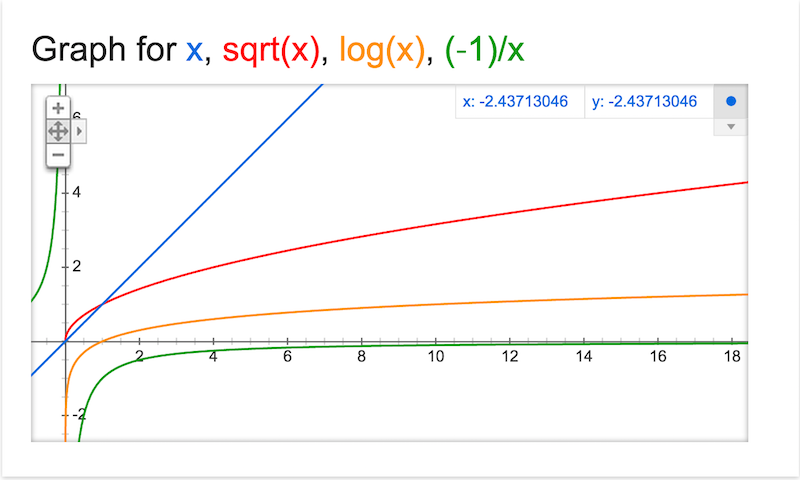

<!-- author: Jason Dolatshahi -->

# data transformations

The exponential distribution is a skewed distribution. Its theoretical minimum
is 0, but the probability of every positive value is greater than zero.

    $ histo -xe
    demo: distr = exp, transf = (none)
    num_blanks = 0
             (0.0208, 0.7558)    **************************************************************************************************************************
             (0.7558, 1.4908)    **************************************************
             (1.4908, 2.2257)    **************
             (2.2257, 2.9607)    ********
             (2.9607, 3.6957)    *****
             (3.6957, 4.4307)    
             (4.4307, 5.1656)    
             (5.1656, 5.9006)    
             (5.9006, 6.6356)    
             (6.6356, 7.3706)    *

This characteristic is common in real-world data that has 0 as a lower bound.
Any sort of count (website visits, housing prices, voter turnout) will display
similarly skewed behavior.

Skewness (or equivalently, the absence of symmetry) can make data difficult to
analyze and compare with other data. **Data transformations** can enforce
greater simplicity on our data, thereby allowing us to gain easier and deeper
insight. You can think of applying a data transformation like choosing a
different representation for your data, or like bringing your data microscope
into focus. The transformation gives you a different point of view, and under
certain important conditions, does not affect your conclusions.

## 1. properties of transformations

Not all transformations are useful to us. We want to use a transformation that
gives us a new perspective on our data while keeping the salient properties of
the data intact.

An example of a transformation that is not useful is the conversion
of feet to meters. Changing units certainly doesn't distort our empirical
conclusions, but it doesn't give us a new perspective either. If the
distribution of heights of all your friends is skewed in feet, it will be
still be skewed in meters. This absence of effect is characteristic of
**linear** transformations, which are composed of translations and constant
changes in scale (this is embodied in the classical regression equation
*y = mx + b*, where *b* represents a translation and *m* a constant scale
factor).

Useful transformations will be **nonlinear**, since it is this nonlinearity
that gives us the desired change in shape. In order to avoid making qualitative
changes to the data, it's necessary to use transformations that are also
 **monotonic**. This property means that the transformation **preserves ranks**;
for a monotonic function *f* and two values *x* and *y*, the ordering *x < y*
holds if and only if *f(x) < f(y)*.

In intuitive terms, you can think of a monotonic function as one that's
non-decreasing, for example, the log function:

A nonlinear transformation gives us the change in shape we need, and a
monotonic transformation preserves ranks and therefore percentiles. A corollary
of this second condition is the fact that the transformation of the *k*th percentile
is the *k*th percentile of the transformed values; therefore the values in the
5NS don't need to be recalculated to be accurately transformed.

Note that moment-based statistics such as the mean and standard deviation don't hold
up to transformations of any kind; the mean of a set of values is different than the
mean of twice each value (a linear transformation).

## 2. `log` & `sqrt`

The **logarithmic function** will be our main weapon to transform data. It has the
monotonicity property we need, and it applies nonlinearity in a useful but not
overwhelming amount. The important properties of this function, called `log`
for short, can be summarized by these three points:

>    *log(xy) = log x + log y*  
>    *log(x / y) = log x - log y*  
>    *log(x ^ k) = k log x*  

These fundamental properties illustrate the original purpose of the log
function: to convert mathematical operations from multiplication to addition.
This simplification was extremely important for arithmetic calculations before
the advent of calculators and computers. Note that the base of the logarithm
doesn't make an important difference for our purposes; logarithms of different
bases simply differ by a constant scale factor, so changing the base is a
linear transformation.

Another important transformation is the square root, called `sqrt` for short.
The `sqrt` function is monotonic and nonlinear, but it brings "less"
nonlinearity (and will remove less skew) than the log function.

This diagram illustrates the growth of each of these functions and their relative
nonlinearity (the other transformations here are valid but less useful):

We can think of the "amount" of nonlinearity contained in each transformation
in terms of powers of *x*. The raw data represents the first power, or *x^1*:

| power | transformation |
| ----- | -------------- |
| +1    | (none) |
| +1/2  | *sqrt x* |
| 0     | *log x* |
| -1/2  | *-1 / sqrt x* |
| -1    | *-1 / x* |

For the sake of completeness, other less-useful transformations are included
here as well.

Smaller powers of `x` reduce skew compared to the raw expression (because these
functions exhibit sublinear growth). Therefore our skew-removal operations will be
carried out with transformations that correspond to powers less than 1. These are
the functions that "sweep the leaves from out of the corners," to use a Tukey
quote.

An important technical point arises at the origin. As you can see from the
diagram, none of these transformations are well-defined when *x=0*. It's
necessary to account for this in practical terms by building a small
work-around into our transformation; namely, by adding a small constant value
whenever *x* is 0 to prevent pathological behavior. You'll have a chance to
try this out in the exercises.
