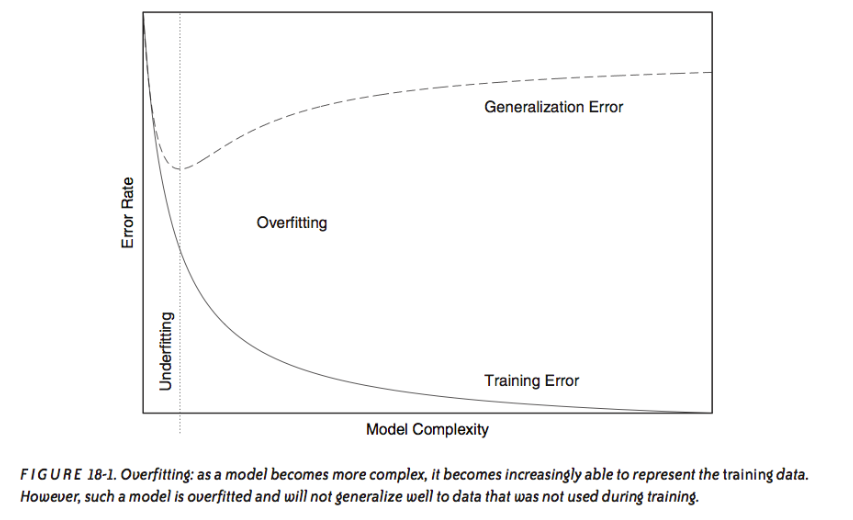

<!-- author: Jason Dolatshahi -->

# concepts of machine learning

## 1. problems in ML

Machine learning (ML) is a subject that deals with the study of algorithms that
learn from data. It encompasses a number of techniques, some of which are
mathematically sophisiticated. Machine learning is a powerful subject, and its
value to data scientists comes from its effectiveness at **solving problems**.

It's important to keep the problem you're trying to solve as the primary object
in your mind; beginning with a machine learning algorithm and attempting to
force a solution to a problem will usually produce disappointing results.

Since problems are so important, it's useful to characterize ML techniques
based on the type of problem they're built to solve. The most general way to
distinguish problems depends centrally on the data.

The most well-known branch of ML is called **supervised learning**. Techniques
like classification and regression are supervised techniques. These predictive
techniques rely on a dataset for which we have some information about the
**target variable**, or the feature we'd like to predict. The goal of
supervised learning is making predictions, or **generalization**.

For example, if you want to build a spam filter to classify email messages as
either *spam* or *not spam*, you need to start with a dataset that contains messages
and their **labels**. This labelling is what permits you to train a classifier
and make predictions.

Alternatively, you may have a dataset with no information about target
variables. If your dataset is a set of newspaper articles, you can
programatically separate them by topic without any information about the topics
themselves by applying an **unsupervised learning** technique. The goal of
unsupervised learning is extracting structure to gain a deeper understanding of
the data.

We will talk about a number of supervised and unsupervised techniques in later
lectures. The important distinction is summarized here:

| type of learning | goal |
| --------------- | ---- |
| supervised | making predictions |
| unsupervised | extracting structure |

## 2. solutions in ML

We've already seen that data can come in numerous forms. Most algorithms can
work with features of different forms, but there is an important distinction
in the form of the target variable.

In the spam filter example above, the target variable was one of two labels:
*spam* or *no spam*. The target variable is categorical, and can take one of
two values. This sort of problem is extremely common, and goes by the
name of **binary classification**.

Another type of problem may involve making a numerical prediction, such as
number of sales per week, number of points scored, or the level of a financial
indicator. These **regression** tasks are usually the most familiar examples of
supervised learning for people who have some background in statistics.

We can incorporate these different forms of the target variable into our
summary table above to get an initial grouping of ML algorithms. This gives you
an easy way to determine which algorithm is appropriate for your learning task:

| type of learning | categorical target | numerical target |
| --------------- | ---- | --- |
| supervised | classification | regression |
| unsupervised | clustering | dimensionality reduction |

This doesn't tell you exactly which algorithm to use, and it certainly doesn't
tell you how to train your model, but it does give you a first idea of what
sort of ML technique is likely to help you solve your problem.

## 3. intro to supervised learning

Imagine the following hypothetical situation: a student is studying for a
final exam. Her instructor has given her a set of practice problems, some
of which may appear on the exam itself. Naturally these practice problems
are a useful study aid, but can you imagine a situation where they could do
more harm than good?

Suppose the student spends all of her time studying the practice problems, and
decides not to read her textbook at all. She studies the practice problems for
so long that she actually memorizes the solutions to each of them. Now if the
final exam is exactly the same as the practice test, she'll do well. But if
some of the exam questions require her to **generalize** the knowledge that the
practice test requires, and if she hasn't spent any time with the textbook,
then she may find it difficult to apply what she's learned to exam questions
she hasn't seen before.

This little parable gives a reasonably close analogy to the situation you face
every time you want to perform a supervised learning task. Suppose you have a
labelled data set and you want to build a supervised model like a classifier.
How do you make it work? In other words, how should you **train** your model?

(Note that in supervised learning the phrases "build a model" or "perform a task"
usually correspond to **training** the **parameters** of a model using a
dataset. This training takes place using some kind of **optimization** method.
Feel free to ignore this for now).

One option would be to train the model using the full dataset. But this
approach will very likely put us in the same position as the student who
memorized her practice test; our model will be good at predicting things it's
already seen, and probably not very good at predicting other things. This is
one of the central pitfalls of machine learning, and it goes by the name of
**overfitting**. An overfit model will have poor **generalization** qualities
because it will be ineffective at making **out-of-sample** (OOS) predictions
(predictions for records that don't appear in the **training set**).

Overfitting occurs when our model fits the noise in the dataset instead of the
signal. Note that **underfitting** can also occur when our model is not
sophisticated enough to extract the structure from the data:

 

How can we combat overfitting? Let's take a step back before we tackle this
question. The reason we want to build a classifier is to make predictions on
new data (clearly we don't need to make predictions on data that we know the
labels for). Therefore the metric that we're really interested in is
**OOS prediction error**. But since we don't know the true labels for OOS data,
we have no way of knowing what the the OOS prediction error is. It's
inaccessible to us!

There is something clever we can do though: we can set aside a small part of
the dataset, train the model on the larger part, and then use the held-out
small part to simulate out-of-sample prediction. This is called a
**train/test split** (sometimes older books call it the
**holdout method**). The portion of the data that we train on is
called the **training set**, and the held-out portion that we use to
(approximately) judge our performance is called the **test set**. The prediction
error on the test set is called the **generalization error**, and it's this that
we use as a proxy for OOS prediction. You can look up theorems that say this
technique is theoretically justified. Typically the training set is 70-80
percent of the full dataset.

Another important question comes up here. Suppose we perform a train/test split
on our dataset, train a classifer on the training set, and measure the
generalization error using the test set. (Recall that this is a proxy for the
true metric of interest, the OOS prediction error. But this is the best we can
do, and furthermore the theorems glancingly referenced above assure us that the
estimate is unbiased.) What do we know about our classifier's performance?

A similar situation occurs in every case of scientific measurement. Suppose you
want to calculate the speed of light. You can set up an experiment to get a
value, but when you've performed the experiment once, how much do you know?

The answer is something, but maybe not much. Even unbiased estimates can have
high variance. Thankfully, mathematics is here to save us. One of the big guns
of probability theory is the **law of large numbers** (LLN), which simply
states that the average outcome of a number of trials will be close to the
expected value, and that this average will get closer to the expected value as
the number of trials increases.

We can use the LLN to form a more robust estimate of our generalization error
using a method called **cross-validation** (CV). Instead of forming a single
train/test split, suppose we partition the dataset into *k* subsets of equal
size. Now we can form *k* estimates of the generalization error by using each
subset in turn as the test set, and the remainder as the training set. After
each of these *k* folds we'll have *k* estimates of our generalization error,
which tells us something more about its distribution than a single estimate
does. The average of each of these *k* estimates will in general be a
lower-variance estimate of the generalization error.

Cross-validation gives us a lower-variance estimate of the generalization error
by using the dataset more efficiently. The example illustrated here is called
k-fold cross validation, and is the most common approach. A typical value for
*k* is 10. Another option is called **leave-one-out** cross-validation, which
is the same as *k*-fold CV with *k = n*, where *n* is the number of records in
the dataset.
