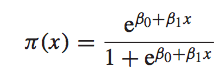
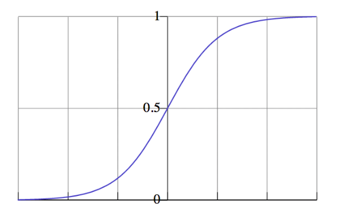

<!-- author: Jason Dolatshahi -->

# logistic regression

## preamble: linear regression

You're probably familiar with linear regression, a fundamental technique 
in predictive modeling that estimates a dependent variable *Y* through a linear
relationship with a covariate (or set of covariates) *X*.

The model relies on a probabilistic
framework where the exact linear relationship between *X* and *Y* is perturbed
by an observed **error term** *ε*. This error term is a random variable which
is assumed to follow a **Gaussian distribution** with mean zero and constant
variance:

    y = α + β x + ε  
    ε ~ N(0, σ^2)  
    σ constant

The linear relationship between *X* and *Y* means that values of *Y* are
unbounded; they can take any real value. The model gives a predicted value 
for each value of *X*, and the difference between the predicted and observed
values of *Y* are called **residuals**. Model parameters are estimated by
minimizing the sum of squared residuals across all observations; this method is
known is known as **ordinary least squares** (OLS).

It can be shown that OLS is a special case of a more general optimization
technique called **maximum likelihood estimation** (MLE), where instead of
minimizing the sum of squared residuals, model parameters are estimated by
maximizing a function proportional to the probability of obtaining the
observed set of data.

## 1. logistic regression

Logistic regression is a close relative of linear regression, but with two main
differences. These differences permit logistic regression to be used for
**classification**, even though it's a regression model.

### dependent variable

The first difference is in the dependent variable *Y*: whereas linear regression
permits *Y* to take any real value, the logistic regression model constrains *Y*
to take only values in the unit interval [0, 1]. The function we use to make this
transformation is called the **logistic function**. 

Notice that it maps each real value into the unit interval [0, 1]:

### probability estimates
These dependent values are all between 0 and 1, so we can interpret them as **probabilities
of class membership**. This is illustrated by the following example.

Suppose we have a number of records that give the (numeric) age of an
individual accompanied by a binary variable that indicates whether the
individual has heart disease. We can visualize the relationship between these
variables using a scatterplot:

### error term

The second difference has to do with the distribution of the error term;
instead of a Gaussian distribution we assume a [**Bernoulli
distribution**](https://en.wikipedia.org/wiki/Bernoulli_distribution) for *ε*.
This distribution models a random variable that can take only the values 0 or
1. (Both of these differences are really two sides of the same coin; they're
consequences of each other.)
