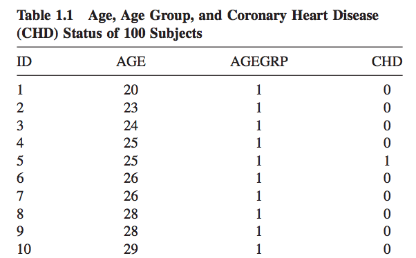

<!-- author: Jason Dolatshahi -->

# logistic regression

## preamble: linear regression

You're probably familiar with linear regression, a fundamental technique 
in predictive modeling that estimates a dependent variable *Y* through a linear
relationship with a covariate (or set of covariates) *X*.

The model relies on a probabilistic
framework where the exact linear relationship between *X* and *Y* is perturbed
by an observed **error term** *ε*. This error term is a random variable which
is assumed to follow a **Gaussian distribution** with mean zero and constant
variance:

    y = α + β x + ε  
    ε ~ N(0, σ^2)  
    σ constant

The linear relationship between *X* and *Y* means that values of *Y* are
unbounded; they can take any real value. The model gives a predicted value 
for each value of *X*, and the difference between the predicted and observed
values of *Y* are called **residuals**. Model parameters are estimated by
minimizing the sum of squared residuals across all observations; this method is
known is known as **ordinary least squares** (OLS).

It can be shown that OLS is a special case of a more general optimization
technique called **maximum likelihood estimation** (MLE), where instead of
minimizing the sum of squared residuals, model parameters are estimated by
maximizing a function proportional to the probability of obtaining the
observed set of data.

The analogy between the classical development of linear regression and the
machine learning interpretation can be seen by regarding the sum of squared
residuals as the **loss function** which we optimize in order to learn the
parameters of the model.

## 1. logistic regression

Logistic regression is a close relative of linear regression, but with two
important differences. These differences permit logistic regression to be used
for **classification**, even though it's a regression model.

### dependent variable

The first difference is in the dependent variable *Y*: whereas linear regression
permits *Y* to take any real value, the logistic regression model constrains *Y*
to take only values in the unit interval [0, 1]. The function we use to make this
transformation is called the **logistic function**. 

Notice that it maps each real value into the unit interval [0, 1]:

### error term

The second difference has to do with the distribution of the error term;
instead of a Gaussian distribution we assume a [**Bernoulli
distribution**](https://en.wikipedia.org/wiki/Bernoulli_distribution) for *ε*.
This distribution models a random variable that can take only the values 0 or
1. You can think of a Bernoulli random variable as the outcome of a coin toss
where the parameter *p* gives the probability of coming up heads.

(Note that both of these differences are really two sides of the same coin;
they're consequences of each other.)

## 2. probability estimates

The key to using the logistic regression model for classification is by
applying a probability interpretation to the dependent variable *Y*. These
values are always between 0 and 1, so we can interpret them as **probabilities of
class membership**. This is illustrated by the following example.

Suppose we have a number of records that give the age of an
individual accompanied by a binary variable that indicates whether the
individual has heart disease:

Like before, we can visualize the relationship between these variables using
a scatterplot. But because the independent variable (age) is real-valued while the
dependent variable (CHD) can take only the values 0 or 1, the relationship is
difficult to see:

We can visualize it more easily by applying a simple transformation to the feature
space. Namely we can bucket the ages into groups (20s, 30s, etc) and look at
the average value of *Y* inside each group:

This makes the trend easier to see:

Logistic regression can be seen as an extension of this simple and practical
point of view where the bucket size shrinks to 1, and where we make class
predictions by applying a **cutoff** to the model's probability estimates at 50%.

## epilogue: glm

The logistic function is the mathematical object that allows us to use a
regression model for classification, and as a result it is key to our efforts.
Here it is again:

Another important mathematical object is the function that maps the
logistic model back to the linear model. This function is called the **logit
function**:

This function links the linear model with the logistic model, and it hints at a
theoretical structure that formalizes the relationship between these two
models. We won't say much about this other than to say that it goes by the
name of **generalized linear models**, and in this context the logit function
is the **link function** of the logistic model.

This is why doing logistic regression in R looks like a call to the `glm`
function with the error family set to Bernoulli, and why the linear & logistic
regression models in sklearn both live in the `linear_model` submodule.
