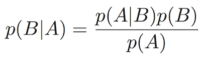

<!-- author: Jason Dolatshahi -->

# naive bayes classification

## preamble: probability theory

Probability is the mathematical theory of randomness. Every application of data
analysis relies on probability, and the style of analysis called **Bayesian
inference** makes this connection explicit.

Let's set up a few definitions to begin. In order to study randomness we need
to be specific about what's behaving randomly and how. We'll call the space of
all possible random outcomes the **sample space**, and we'll call an element of
this sample space an **event**. Events are possible outcomes, like it's rainy
tomorrow or the train is delayed. The sample space defines which outcomes are
possible. If we're thinking about rain, our sample space would be the set of
events *{rain, no rain}* since these are the only possible outcomes.

The random nature of these events may not be equal, and so we define a
**probability** *P* as a number that lets us measure of the size of an event in
a sample space.

The most important fact about probabilities for our purposes is that they
always sum to 1. Said another way, the sum of the probabilities of all possible
events (which is the same as the probability of the sample space itself) equals
1. This fact lets use simple tricks like the following: suppose we're studying a
binary event (eg *{rain, no rain}*). Then the probability of *{no rain}* is just 1
minus the probability of *rain*. We call events like these **complements** of
each other.

Events whose probabilities influence each other are called **dependent events**;
information about one is also information about the other. In the case of
complements, the occurrence of one tells us that the other hasn't occurred (as
illustrated above).  Alternatively, events whose probabilities do not influence
each other are called **independent events**.

Consider a sample space with possible events *A* and *B*. The notion of the two
events occuring jointly (*A* happens and *B* happens) can be written *AB*. If
*A* and *B* are independent, then the probability *AB* is the same as the
product of their probabilities: *P(AB) = P(A)P(B)*.

Events *A* and *B* can inform us about each other through independence or 
complementarity, or through a variety of other ways. The mathematical language
we use to describe dependent events is called **conditional probability**.
The conditional probability of *A* **given** *B* is written *P(A|B)*. If *A*
and *B* are independent, then information about one does not give us
information about the other. In this case *P(A|B) = P(A)*.

If you take a small trip into abstraction, you can imagine writing every event
*A* as a conditional probability *P(A|I)* where *I* represents all of the
background knowledge available to you. For example if you're measuring events
with a telescope or a particle collider, *I* could represent all the knowledge
of physics. Mathematically speaking, *I* would represent the sample space,
or the set all possible combinations of events.

This construction allows us to make an interesting observation about conditional
probability. Since the probability of A given B is written *P(A|B)*, we can
interpret conditional probability as an operation that **changes the sample
space** that probabilities are measured against.

## Bayes' Theorem

The foundation of Bayesian inference is a statement about conditional
probabilities called **Bayes' Theorem**, which gives us a way to go between
conditional probabilities *P(A|B)* and *P(B|A)*. Here it is:

