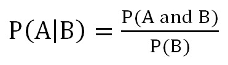

<!-- author: Jason Dolatshahi -->

# naive bayes classification

## preamble: probability theory

Probability is the mathematical theory of randomness. Every application of data
analysis relies on probability, and the style of analysis called **Bayesian
inference** makes this connection explicit.

Let's set up a few definitions to begin. In order to study randomness we need
to be specific about what's behaving randomly and how. We'll call the space of
all possible random outcomes the **sample space**, and we'll call an element of
this sample space an **event**. Events are possible outcomes, like it's rainy
tomorrow or the train is delayed. The sample space defines which outcomes are
possible. If we're thinking about rain, our sample space would be the set of
events *{rain, no rain}* since these are the only possible outcomes.

The random nature of these events may not be equal, and so we define a
**probability** *P* as a number that lets us measure of the size of an event in
a sample space.

The most important fact about probabilities for our purposes is that they
always sum to 1. Said another way, the sum of the probabilities of all possible
events (which is the same as the probability of the sample space itself) equals
1. This fact lets use simple tricks like the following: suppose we're studying a
binary event (eg *{rain, no rain}*). Then the probability of *{no rain}* is just 1
minus the probability of *rain*. We call events like these **complements** of
each other.

Events whose probabilities influence each other are called **dependent events**;
information about one is also information about the other. In the case of
complements, the occurrence of one tells us that the other hasn't occurred (as
illustrated above).  Alternatively, events whose probabilities do not influence
each other are called **independent events**.

Consider a sample space with possible events *A* and *B*. The notion of the two
events occuring jointly (*A* happens and *B* happens) can be written *AB*. If
*A* and *B* are independent, then the probability *AB* is the same as the
product of their probabilities: *P(AB) = P(A)P(B)*.

Events *A* and *B* can inform us about each other through independence or 
complementarity, or through a variety of other ways. The mathematical language
we use to describe dependent events is called **conditional probability**.
The conditional probability of *A* **given** *B* is written *P(A|B)*. If *A*
and *B* are independent, then information about one does not give us
information about the other. In this case *P(A|B) = P(A)*. More generally, when
*A* and *B* can influence each other, we can define the conditional probability
by the following expression:

If you take a small trip into abstraction, you can imagine writing every event
*A* as a conditional probability *P(A|I)* where *I* represents all of the
background knowledge available to you. For example if you're measuring events
with a telescope or a particle collider, *I* could represent all the knowledge
of physics. Mathematically speaking, *I* would represent the sample space,
or the set all possible combinations of events.

This construction allows us to make an interesting observation about conditional
probability. Since the probability of A given B is written *P(A|B)*, we can
interpret conditional probability as an operation that **changes the sample
space** that probabilities are measured against.

## Bayes' Theorem

The foundation of Bayesian inference is a statement about conditional
probabilities called **Bayes' Theorem**, which gives us a way to go between
conditional probabilities *P(A|B)* and *P(B|A)*. Here it is:

Mathematically speaking, this is just an identity that comes from a simple
application of the definition of conditional probability (proof left to the
reader). We can make another interpretation that's more focused on data
analysis if we set up some vocabulary first.

The quantity on the left-hand side of the equals sign is the quantity of
interest in Bayesian inference. But instead of speaking of a target variable,
in the Bayesian case we have a target distribution. Suppose we specify that 
event *A* is a member of our feature space, and event *B* is the presence of
a particular label. We want to use the data to make inferences about the
distribution of classes, and *P(B|A)* is the mathematical object that contains
this information. The Bayesian term for this is the **posterior distribution**.

The principal mathematical object that we use to learn the posterior
distribution is the quantity *P(A|B)*, which represents the probability of
observing the data we actually have given the labels. This is called the
**likelihood function**, and it's the engine of Bayesian inference.

The quantity that multiplies the likelihood function, *P(B)*, is the
unconditional (or marginal) distribution of the classes. This term is called
the **prior distribution**, and represents our a priori knowledge about the
target distribution.

Selecting the prior distribution to use for your problem is an important part
of Bayesian inference. The right choice should both encapsulate your
knowledge about labels and have a functional form that's convenient to use in
calculation. If you know what form your posterior should take (more
specifically, if you know what family of distributions it should belong to),
then you can use the **conjugate prior** for that family to simplify your
calculation. Conjugate priors share analytical properties with families of
posterior distributions that make them convenient to implement in practice.
In any case, it's easy to show that the influence of the prior on the estimate
of the posterior decreases as the number of records in the dataset increases.

The quantity in denominator on the right-hand side of the equals sign is just a
scale parameter, and as such doesn't qualitatively influence estimation of the
posterior distribution. Sometimes this quantity is called the **evidence**, but
most of the time you can think of it as just a number.

We can describe the data analysis problem in the Bayesian framework as
estimation of the posterior distribution using the combination of the prior and
the likelihood function. The likelihood function is the empirical engine of
Bayesian inference. You can think of the likelihood function as taking in data
points one at a time and **updating** the estimate of the posterior distribution
as it does so.

## naive Bayes classification
