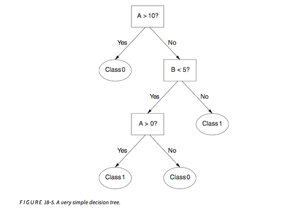
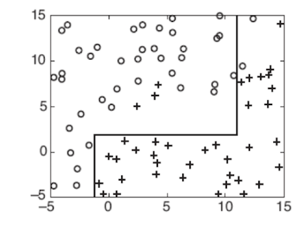
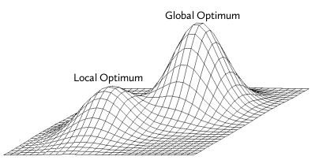

<!-- author: Jason Dolatshahi -->

# decision tree classifiers

## trees are graphs

A decision tree classifier is almost like a game of 20 questions. The model
creates a non-linear decision boundary by evaluating records against a number
of **test conditions**.

These conditions can be represented in a type of **graph** called a
**tree**, which is comprised of **nodes** and **edges**. The tree begins at the
**root node**, which is (perhaps confusingly) usually shown at the top of the
tree:

One of the important strengths of decision trees, apart from their good
empirical performance, is their ease of **interpretability** as this diagram
illustrates.

The tree structure comes from the hierarchical relationships between the nodes.
A consequence of this hierarchy is that the edges between the nodes are
**directed edges**. These are usually drawn as edges with arrows, where the
direction that the arrow points has meaning.

The root node of the tree has outgoing edges that terminate
in deeper nodes. These deeper nodes correspond to test conditions to be applied
after the root node condition. This relationships between nodes are usually
described by saying that an upstream node is the **parent** of its downstream nodes,
and a downstream node is the **child** of its parent nodes. Nodes with both parents
and children (eg, with both incoming and outgoing edges) occur in the middle
layers of the tree and are called **internal nodes**.

The parent-child relationships continue down through the tree until a layer of
nodes that has parents but no children. These are called **leaf nodes**, and they
correspond to class labels. By evaluating a record against the test conditions in
the tree (in order), we arrive at a leaf node for each record that represents a
class prediction.

## decision boundaries

Look at this picture of a decision boundary produced by a simple decision tree:

The decision boundary is nonlinear, but it is composed of linear pieces. A
curve with this shape is sometimes called **piecewise linear** or
**rectilinear**. It is capable of adapting to more complex shapes than a linear
decision boundary, but by the same token, it is also capable of adapting too
much and becoming too complex. We can summarize this by saying that decision
trees are **low bias** (lower than a linear classifier) and **high variance**
classifiers.

Low bias and high variance gives us a promising candidate for classification,
if only we could reduce the variance somehow. We'll see a couple of ways to do
this now, and a more powerful way in the next lecture.

## complexity

A piecewise linear decision boundary is flexible (low bias) but susceptible to
overfitting (high variance). This complexity has many different sources, and
there are a number of ways to control complexity in (eg to **regularize**) a
decision tree.

Some of the complexity comes from the depth of the tree; a long series of test
conditions is more complex than a short series. Complexity can also come from
allowing leaf nodes to exist for only a small number of records; this corresponds
exactly to the (by now) familiar picture of an overfit decision boundary.
Scikit-learn allows us to control complexity from these sources with input
parameters.

Still more complexity can come from the number of permitted splits per node.
The popular implementation **C4.5** puts an explicit penalty on the number of
outcomes, and another popular implementation called **CART** restricts test
conditions to be boolean (true/false) only. This gives us a maximum of two outgoing
edges per node, and the resulting graph is called a **binary tree**.
Scikit-learn learns decision trees using a version of the CART algorithm.

Note that like all regularization, these techniques aim to remove complexity by
incurring a bit of (presumed tolerable) inaccuracy. This is the **bias/variance
tradeoff** in action. But none of these address the largest source of variance
in a decision tree.

## growing trees

How is a decision tree constructed? The key step is in how the test conditions
are created.

Each test condition imposes a **partition** on the records in the data being
evaluated, meaning that the condition sends each record down exactly one branch
of the deeper parts of the tree. Since class predictions occur at the deepest
level of the tree (at the leaf nodes), partitions that lead to rapid prediction
will be preferred. These partitions will produce trees of less depth and
therefore less complexity, other things equal.

This is captured in the notion of **purity**. The ideal decision tree will use
a test condition at each node that creates a partition with the highest
possible purity. There are a handful of ways to calculate this maximum purity
partition (using optimization functions like the Gini coefficient, the
entropy, the classification error, or the information gain ), but we don't need
to treat each of these in detail.

The most important feature of decision tree learning is not the optimization
function used, but rather the simplification we have to apply in order to be
able to learn the model at all.

Recall the key assumption made in the naive Bayes classifier, where we impose
conditional independence on the likelihood function *P(X|Y)* by force in order
to achieve a workable problem. This application of the **bias/variance
tradeoff** is what gives naive Bayes its name, and what transforms an
intractable problem into something we can usefully solve.

There's a similar situtation with decision trees, and the reason it exists has
to do with finding the optimal partition at an internal node. An exhaustive
search of the feature space is exponentially complex (*O(2^n)* for an
*n*-dimensional feature space using binary splits only). This brute-force
approach is too complex to undertake, so we make a simplifying assumption that
gives us a shot at coming up with a practical solution.

The simplifying assumption this time comes in a different shape than we've seen
before, but it's really the same idea. Instead of the exhaustive search of the
feature space, we simplify the search by using an algorithm that finds **local
optima** of the non-convex optimization surface. A local optimum is a solution
that relies on a given neighborhood of points, but does not take the global
structure of the space into account:

Algorithms that make local decisions like this are sometimes called **greedy
algorithms**, and sometimes (more generally) called **heuristic algorithms**.
Local optimization is a large source of variance in decision trees, since the
globally optimal tree cannot be guaranteed in any iteration of the learning
algorithm.

As we'll discuss next time, this is what makes trees good candidates for
combining into ensembles. If you think of learning the tree as the result of an
experiment, we can use the LLN to build a solution that converges (in
expectation) to the true performance metric by creating an average performance
metric over a number of repeated experiments. This is the idea behind **ensemble
classifiers**.
