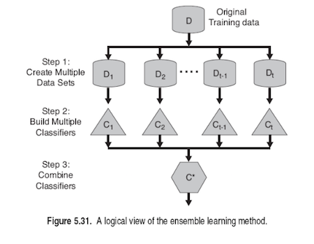
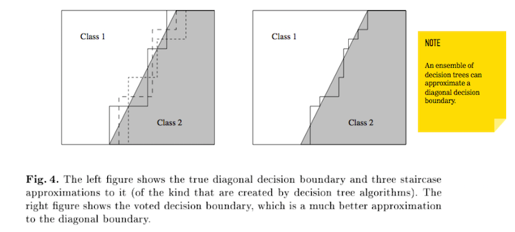

<!-- author: Jason Dolatshahi -->

# ensemble classifiers

Ensemble classifiers are typically the best choice for practical machine
learning applications due to their ability to combine models together using
powerful **variance reduction** techniques.

They are formed by collections of **base classifiers** which are combined
together either by averaging predictions or by majority vote. (Note that
averaging takes place before threshholding probabilistic predictions to a class
label, while majority vote takes place after.)

Combining base classifiers together in either of these ways leverages the power of
the **LLN** to reduce variance across the base classifiers. This is similar to its
use in cross-validation, where we use it to reduce variance across training
folds. The more base classifiers we use, the lower we can push the variance,
but this improvement comes at additional computational expense and with
diminishing marginal returns.

Good base classifiers explore as many candidate decision boundaries (or
**decision surfaces**, in higher dimensions) as possible while keeping aggregate
predictions as close to the true decision surface as possible. Another way of
saying this is that the variance reduction properties of the LLN permit ensemble
classifiers to leverage the benefits of **low bias** base classifiers while
offsetting some of the associated **high variance**. Decision trees (low bias, high
variance) make good base classifiers, and many popular ensemble techniques are
collections of trees.

## creating multiple base classifiers

How can we train multiple base classifiers using the same dataset? The answer
is to introduce some randomness into model training, either through the data
(using sampling methods) or through the algorithm (using heuristics to
approximate the learning problem).

One method called **bagging** learns each base classifier on a random sample of
the training data. Random samples are created from the training data by
**sampling with replacement** using a uniform sampling distribution. This
sampling technique frequently goes by the names **resampling** or **bootstrapping**.
Combining bagged estimates is a variance reduction technique, and gives us a way
to use low bias base classifiers while dodging most of the high variance they
come with. Deep trees are effective base classifiers for bagged ensembles, since
the complexity that their depth brings is associated with lower bias and higher
variance.

Another method called **boosting** again uses resampling of the training data,
but this time with an **adaptive sampling** distribution. Base classifiers
in a boosted ensemble are trained sequentially, and at each step the sampling
distribution is updated to place more emphasis on records that are difficult to
classify. For example, if a record is misclassified by a particular base
classifier, the probability of it coming up again in the next training sample is
increased. This is somewhat related to the example of studying for an exam that
we used to motivate the train/test split, but in this case the student focuses
more on the difficult problems and less on the easier problems as the exam draws
closer.

The boosted classifier's adaptive sampling distribution makes special effort to
fit the most complex parts of the true decision surface. This is a unique case
of **bias reduction**, since it is exactly the areas of greatest complexity
(eg, the most difficult records to classify) that boosting focuses on the most.
Combining boosted base classifiers into an ensemble gives us variance reduction
as well, and the powerful combination of these effects is what makes boosted
classifiers so effective in practice.

Boosted ensembles work well with high bias base classifiers like shallow trees
(or **decision stumps**, which have a maximum depth of 1). This is because their
simplicity is iteratively corrected by the adaptive sampling distribution, but
only as needed. The main drawback of boosted ensembles is their lack of
scalability; the adaptive sampling distribution is computationally intensive
and it creates a dependency among the base classifiers, so the problem of
learning the ensemble cannot be decomposed into independent subproblems for
parallelization.

Another popular ensemble technique is called the **random forest**. Random forests
are ensembles of bagged decision trees that introduce additional randomness
into the training process by randomly selecting test conditions from among the
top *k* candidate test conditions at a given node. This heuristic gives random
forests greater bias than a single decision tree, but bagging the base classifiers
gives substantial reductions in variance as before.

Random forests tend to perform nearly as well as boosted ensembles, and have
the added benefit of being easy to scale; bagged trees can be learned in
parallel and their predictions combined later without difficulty.

## hyperparameters

There are a number of hyperparameters we can use to make bias/variance choices
in the base classifiers as well as in the ensemble itself. The most important
of these is the number of base classifiers in the ensemble (`n_estimators` in
sklearn), which as we saw before is proportional to the reduction in variance,
but requires additional computation and brings diminishing marginal returns.

Another important hyperparameter for a tree-based ensemble is the maximum number
of features to consider when making a split (`max_features`). Using smaller subsets
of features leads to more bias (more likelihood of underfitting) but lower variance.

The authors of scikit-learn share the following
[tips](http://scikit-learn.org/stable/modules/ensemble.html#parameters)
for the many hyperparameters available in ensemble prediction. For
classification problems they suggest setting `max_features` equal to the square
root of the number of features, and to maximize the variance of the base
classifers by using maximally developed trees (`max_depth=None,
min_samples_split=1`).

## conceptual problems in classification

Our task in classification is to learn a model that creates a decision surface
which approximates the true decision surface present in our dataset. There are
a couple of important conceptual issues that arise when thinking about
approximating a decision surface that it turns out ensemble techniques can help
us out with.

These issues go by different names in different sources (and are sometimes
grouped differently), but a useful way to characterize them is with two broad
labels: the **statistical problem** and the **mathematical problem**.

### statistical problem

Recall that we fall back on **heuristic** techniques when discussing the naive
Bayes classifier and decision trees in order to make a computationally
intractable problem feasible. In the case of naive Bayes, we substitute a
complicated and high-dimensional joint density function (the likelihood
function) with a watered-down version that exhibits conditional independence
among the features. In the case of decision trees, we substitute an exhaustive
search of the space of possible trees with a sampling method that selects
splits based on some random criteria.

In both cases we apply these simplifications to drastically reduce the complexity
of the **hypothesis space**, the space of possible models. This simplification
is crucial but does not come without a cost; in particular, it reduces the ability
of any model constructed under these simplified conditions to achieve the true
decision surface. Equivalently, we get a (necessary) reduction in variance
along with a (hopefully tolerable) increase in bias.

Again in both cases, implementing these simplifications is equivalent to
replacing our convex (global) optimization problem with a **non-convex** (local) 
problem. Non-convex optimization is difficult because even if we find an
optimum, we're not guaranteed that it's any good compared to optima that may
live in different parts of the function (eg outside the region of locality).
The only way to know this is to have
knowledge of the entire space, and this is precisely what we'd like to
avoid. Instead we adopt the approach of starting at a given point, looking for
an optimum only in a **neighborhood** of that point, and stopping once we've
found one. Naturally this approach is sensitive to the choice of starting
point; different starting points can easily lead to different results.

This is the nature of the statistical problem: non-local optimization is 
inherently a high-variance strategy. Luckily the same probabilistic argument that
gives us **variance reduction** by cross-validation can be applied to this problem.
In particular, while in cross-validation the LLN guarantees us a sequence (of
averages) that converges to the true generalization error across several folds
(when training a single classifier), in the case of ensembles we get a sequence
that converges to the true generalization error across several base classifiers.

In practical terms, this means that we can construct an ensemble of decision
trees, each of which are learned using heuristic techniques, but which taken
together are more powerful than the sum of their parts.

### mathematical problem

The decision surface is a mathematical object that we use to think about the
distribution of classes in our data. Our modeling approach is to numerically
approximate this mathematical object for practical purposes. In order to do
this, we have a set of modeling techniques available to us that can construct
decision surfaces of varying levels of complexity. But we've seen that the more
complex a model becomes, the higher the likelihood that it will overfit our data
and fail to be useful out of sample.

Consider as a simplified example the case of a two-dimensional feature space
separated by a diagonal linear decision boundary. Naturally a linear model can
approximate a linear decision boundary well, but as we saw last time, a decision
tree creates rectilinear decision boundaries, and cannot achieve a (low
variance) linear boundary on its own. The hypothesis space of the possible
decision boundary approximations that a single decision tree can create does
not contain the true decision boundary.

However when grouped together, several decision trees can create a better
approximation than any single tree. This is again a result of the LLN (averages
converge to true values and improve with the number of trials). As the image
shows, ensembles expand the hypothesis space of possible decision boundaries by
constructing sequences that live in the space, but whose limits (in this case, the
true decision boundary) need not live in the space:

