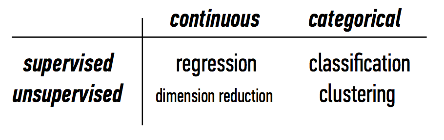

<!-- author: Jason Dolatshahi -->

# clustering

## unsupervised learning

The models we've discussed up to this point are models for **supervised**
learning. Supervised learning techniques use labelled data to train a model and
make predictions. If we don't have labelled data, we can't apply supervised
methods, but we can still use machine learning to enhance our understanding of
the data.

**Unsupervised** learning encompasses the set of techniques that we can apply
to datasets where labelled training data is missing. Our goal with these
techniques less exact than in supervised learning; in this case, we don't aim
to make predictions, but rather to extract structure from the data in a
model-driven way. As a result these can be considered exploratory techniques, and
model evaluation is less rigorous than for supervised learning.

## clustering

An unsupervised problem with a categorical target variable puts us in the realm
of **clustering**.

Our goal in clustering is to programmatically divide our data into a number of
groups. Some methods (like the one we'll look at here) require us to specify
the number of groups we're looking for, while others do not.

We can define a cluster as a group of **similar** data points. Due to the
uncertainty in cluster assignments, we can interpret these as "potential"
class assignments, but keep in mind that this relies on the algorithm's output
as well as on our choice of the number of clusters.

## k-means clustering

**K-means clustering** is a simple, popular, and scalable clustering technique
for numerical data. The algorithm takes an integer *k* as its input, which
corresponds to the number of clusters to return. Each record is iteratively
assigned to a cluster 

    get input k
    specify k initial **centroids**
    - randomly, explicitly, or “smart” (kmeans++)
    for each point, assign to nearest centroid
    re-calculate centroids
    repeat until stopping criterion (tol)
    - centroids change by no more than eps

k-means clustering
- nearest neighbor/prototype method
- greedy algo: each record assigned to cluster based on local structure
- recall greedy is related to local optimization; depends on initial conditions
- frequently run a number of times

notes:
- this algo is **k-means**
- use of mean requires **numerical features**
- centroid does not need to be member of dataset
- need to define similarity!

## similarity measures

distance <—> similarity
easiest for numerical data: euclidean distance

## etc

have to specify number of clusters
tends to create clusters of equal size
result = voronoi diagram
clusters (distances) are not scale invariant!

variation (eg for ctg features): **k-medoids**
- centroids need not belong to dataset

choice of similarity depends on data

strings:
- jaccard = IP addresses (4-ples)
- lev = strings

numbers: euclidean

## cluster validation
how do you know how well you’ve done?
difficult to answer, but can make some basic empirical measurements of algo effectiveness
 
- **cohesion/inertia** measures effectiveness within a cluster (want this to be low)
- **separation** measures effectiveness between clusters (want this to be high)

- **sc** combines these (defined per point)
—> takes values between -1 and +1
—> high sep, low coh = sc of 1
—> sc can be < 0 if clusters overlap (bad)
—> can be averaged within cluster or across clusters for higher-level metrics

these numbers can be used to suggest clusters that should be merged, split, etc

can also be used to select value of k (eg model selection)

## fin
lots of differetn clustering techniques, diff strenghts & weaknesses
