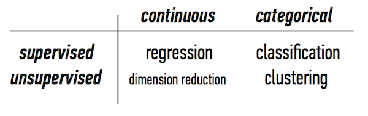
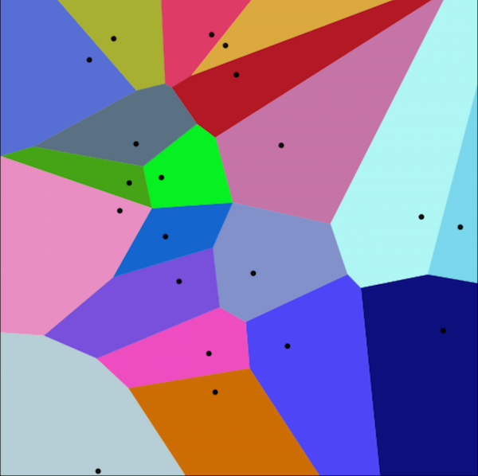
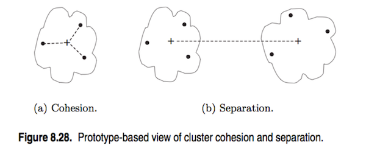
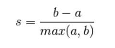

<!-- author: Jason Dolatshahi -->

# clustering

## unsupervised learning

The models we've discussed up to this point are models for **supervised**
learning. Supervised learning techniques use labelled data to train a model and
make predictions. If we don't have labelled data, we can't apply supervised
methods, but we can still use machine learning to extract structure from our
data.

**Unsupervised** learning encompasses the set of techniques that we can apply
to datasets where labelled training data is missing. Our goal with these
techniques less exact than in supervised learning; in this case, we don't aim
to make predictions, but rather to enhance our understanding of the data in a 
model-driven way. As a result these techniques are somewhat exploratory, and
model evaluation is less rigorous than in supervised learning.

## clustering

An unsupervised problem with a categorical target variable puts us in the realm
of **clustering**.

Our goal in clustering is to algorithmically divide our data into a number of
groups. Some methods (like the one we'll look at here) require us to specify
the number of groups we're looking for as a hyperparameter, while others do not.

We can define a cluster as a group of **similar** data points, and it turns out
that most of the work in performing a clustering task has to do with specifying
what we mean by "similar".

## k-means clustering

**K-means clustering** is a simple, popular, and scalable clustering technique
for numerical data. The algorithm takes an integer *k* as its input, which
corresponds to the number of clusters to return, and begins by selecting *k*
initial **centroids**, each of which will serve as the center (sometimes called
the **prototype**) of a cluster. These initial centroid positions can be selected
randomly, explicitly, or using an optimized configuration scheme (used by
[default](http://scikit-learn.org/stable/modules/generated/sklearn.cluster.KMeans.html)
in sklearn) called `kmeans++`.

The algorithm proceeds by assigning each point to its nearest centroid, and then
re-calculating the centroids (by averaging across all points in the cluster) once
these assignments are complete. These steps are repeated iteratively until a stopping
criterion is met. In sklearn, this stopping criterion is a condition on the amount
that centroids change from one iteration to the next (or a maximum number of
iterations, whichever occurs first).

Because k-means clustering makes a cluster assignment for a given point based on
the neighborhood of points nearby (eg it makes local optimizations), it belongs
to the family of techniques called **neighborhood methods**. These methods are
**greedy**, meaning they make decisions based on local rather than global
structure. As a result, k-means is a high variance technique and sensitive to
initial conditions. The high variance is typically offset by running the
clustering algorithm a number of times (using different initial centroid
configurations) and using a voted majority as the final result.

Note that the calculation of centroids relies on taking averages, which means
that k-means is valid only for feature spaces where the average is
well-defined (like numerical feature spaces). Centroids are averages of other
points, meaning they are members of the feature space, but they're not
necessarily members of the dataset.

An alternative formulation called **k-medoids** clustering can be used for
elements like strings that cannot be averaged. In this case the median is used
instead of the average (note that unlike the average, the median exists for any
ordered type), and in this case the centroid must belong to the dataset.

## similarity measures

All of the empirical information that k-means uses to create a solution is
stored in a mathematical object called the **distance matrix**. Since distances
and similarities are the same, this is sometimes referred to as a
**similarity matrix** (usually you talk about distances between numerical
records, and similarities between records like strings). The distance matrix
stores pairwise distances between all records, and therefore is fully
determined by the function we use to calculate these distances.

This important function is called the **distance function** (or **similarity
function), or more formally a **metric** on the feature space. The metric gives
us a quantitative means to compare two records together. Certain mathematical
properties that metric functions must satisfy ensure that these comparisons are
rigorous and internally consistent.

The choice of distance function to use depends on the type of data that we're
working with. For numeric data, the most popular choice is the familiar
**Euclidean distance**:

Working with strings or other data requires different choices of metric.
Strings are often compared using the Levenshtein distance, which is a function
of the number of substitutions it takes to map one string to another. Other
types of data (documents, IP addresses, etc) that can be represented as sets
can be compared using a metric called the Jaccard coefficient, which measures
the size of their intersection divided by the size of their union.

It's important to keep in mind when working with clustering algorithms that
their reliance on distances means that they can be very sensitive to
differences in scale. As a result, numeric features should always be
standardized before application of a clustering technique.

The result of the k-means algorithm is a mapping of points to clusters, or
equivalently a partition of the set of points. Partitions such as these have
been studied independently of clustering algorithms, and frequently go by the
name **Voronoi diagrams**. Additionally, note that k-means tends to create
clusters of equal size.

## cluster validation

Though the goals of unsupervised learning are more open ended and less
conclusive than those of supervised learning, there are still some basic
empirical metrics we can use to judge the performance of a clustering
technique. These metrics can be used for model selection (eg, selecting a value
for *k*), or for identifying clusters that may be separated or merged.

The first of these is the **cohesion** (called **inertia** in sklearn), which
measures the effectiveness of the clustering scheme within a given cluster:

Another useful metric is the **separation**, which measures the effectiveness
of the clustering scheme between clusters:

The cohesion of a cluster is given by the sum of the within-cluster distances,
so low values correspond to good clustering outcomes. Conversely, the separation
between two clusters is given by the distance between their centroids, so high values
correspond to good clustering outcomes.

It's possible to combine these metrics into a single number called the
**silhouette coefficient**:

The silhouette coefficient takes values between -1 and 1. The ideal case of
high separation and low cohesion corresponds to a value close to 1, while
negative values of the silhouette coefficient indicates that we have
overlapping clusters.

Silhouette coefficients are defined on a per-record basis, but they can be
averaged within clusters or across clusters to create higher-level assessments
of the clustering scheme.

This plot shows how the average silhouette coefficient can be used to select
the optimal value of *k*:

