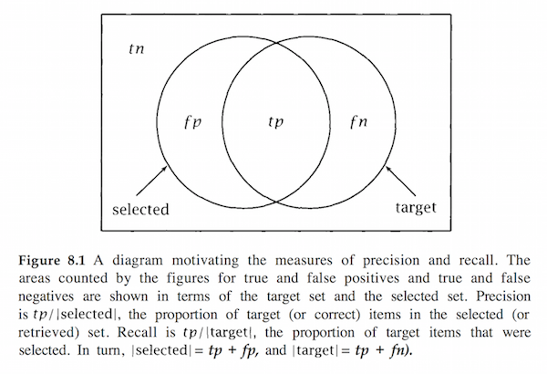

<!-- author: Jason Dolatshahi -->

# evaluating model performance

## subtleties in evaluating classifiers

Consider a binary classification task (eg, a supervised learning task with two
possible outcomes). We can encode the binary target variable as an integer, so
1 corresponds to the positive outcome, and 0 to the negative outcome. If our
problem was fraud detection, then a transaction labelled 1 would correspond a
transaction we suspect is fradulent.

Suppose that the proportion of transactions that are fradulent is quite low;
many common applications of machine learning deal with **class imbalance**
situations where the ratio of negative to positive records is on the order of
1000 or more. If we were to build a model and judge its effectiveness solely
using accuracy, it would be easy to be misled. A trivial classifier that
labels each record as negative regardless of its features would be 99.9%
accurate in this case, but this assessment does not contain the information we
need to evaluate and compare models.

There are two ways for a model to make an inaccurate prediction in binary
classification: either it assigns a positive label to a record
that should be labelled negative (**false positive**), or it assigns a negative
label to a record that should be labelled positive (**false negative**).
There are also two ways to make accurate predictions: **true positives** and
**true negatives** are defined analogously.

Just as class imbalance is a common phenomenon in practical machine learning,
so is the presence of inequal costs associated with either type of inaccuracy.
In fraud detection a false positive could lead to a lost sale or a lost
customer, whereas in digital advertising a false positive may be relatively
cost-free.

Clearly evaluating model performance using a naive measure of accuracy like
**0/1 loss** is not sufficient to address these issues. But we can arrange the
prediction outcomes into a more useful format called a **confusion matrix**
that allows us to be more specific in our evaluation, and that forms the basis
for the other evaluation metrics we'll discuss.

## confusion matrix

The confusion matrix for a binary classification task is simply a 2x2 matrix
with true values of the outcome variable on one axis and predicted values of
the outcome variable on the other axis:

Correct predictions occur on the diagonal of the matrix, while the off-diagonal
entries correspond to incorrect predictions.

A number of useful metrics can be simply derived from the confusion matrix. The
**true positive rate** is given by the ratio of true positives to all
positive records, or *tp / (tp + fn)*. Keep in mind that a false negative is a
record that we identify as negative, but is actually positive.

Similarly the **false positive rate** is given by the ratio of negatives
incorrectly classified to all negative records, or *fp / (tp + fp)*. Keep in
mind that a false positive is a record that we identify as positive, but is
actually negative.

## points in ROC space

We can evaluate and compare classifiers by plotting their tp and fp rates in a
two dimensional plot. The two-dimensional space that this plot depicts is
called **ROC space**:

Each classifier produces a single confusion matrix, a single tradeoff 
between true positives and false positives, and therefore a single point in ROC
space.

Note that the point *(0, 0)* corresponds to a classifier that makes no
positive predictions; its false positive rate is zero, but so is its true
positive rate. Similarly, the point *(1, 1)* corresponds to a classifier that
makes no negative predictions; its true positive rate is 100%, but so is its
false positive rate. The diagonal line that connects these points corresponds
to the region of ROC space where *tpr = fpr*; this is the case of random
classification, where the model performs no better (or worse) than a coin toss.

The point (0, 1) corresponds to perfect prediction. This is where we'd like our
model to be, but perfection is rarely attainable. Typical classifiers will land
in the region above the diagonal; these points correspond to models that use
the information in the data to make predictions that are better than random.
Only a pathological classifier will land in the region below the diagonal;
points in this region represent classifiers that use the information
they find in the data incorrectly (eg, to make backwards predictions).

Points near the lower-left of the plot can be regarded as "strict" classifiers;
they keep their false positive rates down by requiring strong evidence to make
a positive prediction, and so true positive rates are also low.

Points near the upper-right of the plot can be regarded as "lenient"
classifiers; they require little evidence to make a positive prediction, so
their true positive rates and false positive rates are both high.

## curves in ROC space

The picture of classification we've been using so far, where a classifier
corresponds to a single point in ROC space, is accurate if the only thing our
classifier can do is predict a label. More generally, if the model predicts a
score or a ranking for a record, then it can be combined with a choice of
**threshold** to make a binary classifier (recall that this is how logistic
regression works). In this case each threshold value produces a point in ROC
space, and so by varying the threshold we trace out an **ROC curve**:

- roc insensitive to class distr
- auc
- can be extended to multi-class case

## precision vs recall

The intuitive meaning of these terms can be seen in the following diagram:

Our classifier creates a mapping from records to labels, and these labels are
either correct or incorrect. Using the notation in the confusion matrix, the
set of all predictions (the **selected** set) is given by *tp + fp*.

The data our classifier evaluates contains a proportion of positive records,
some of which we identify and some of which we miss. Using the notation in the
confusion matrix, this **target** set is given by *tp + fn*.

